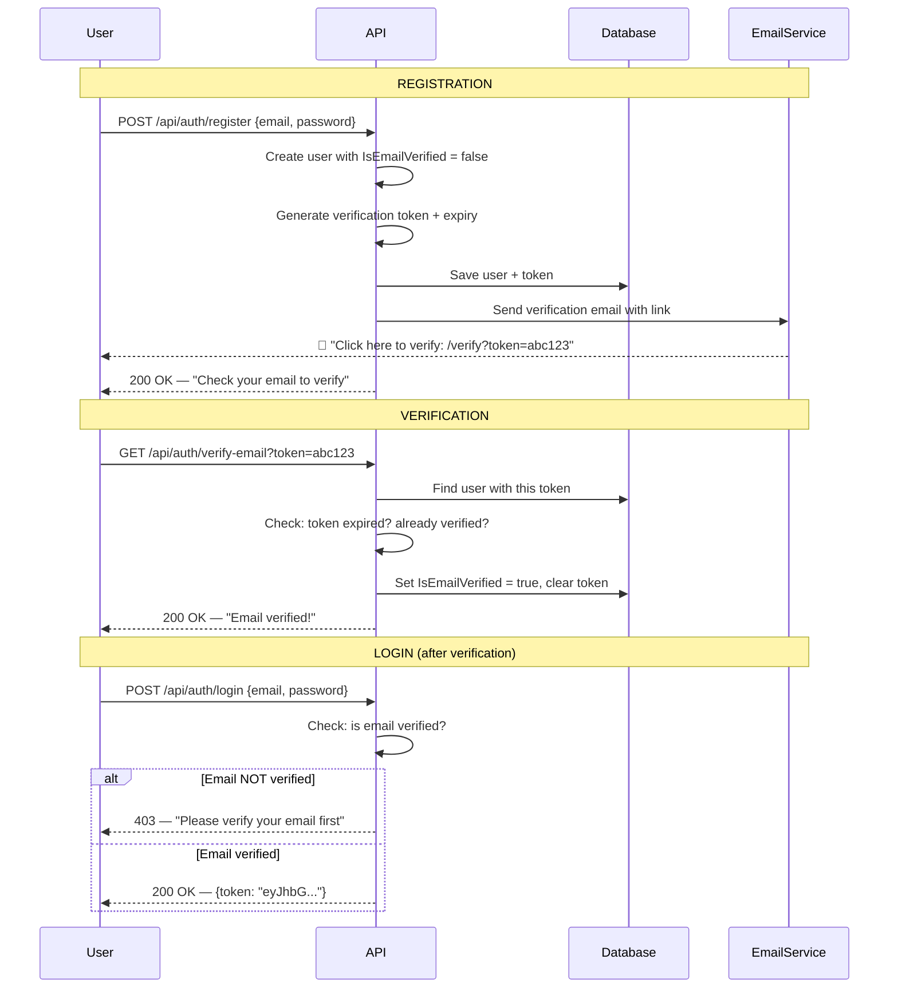
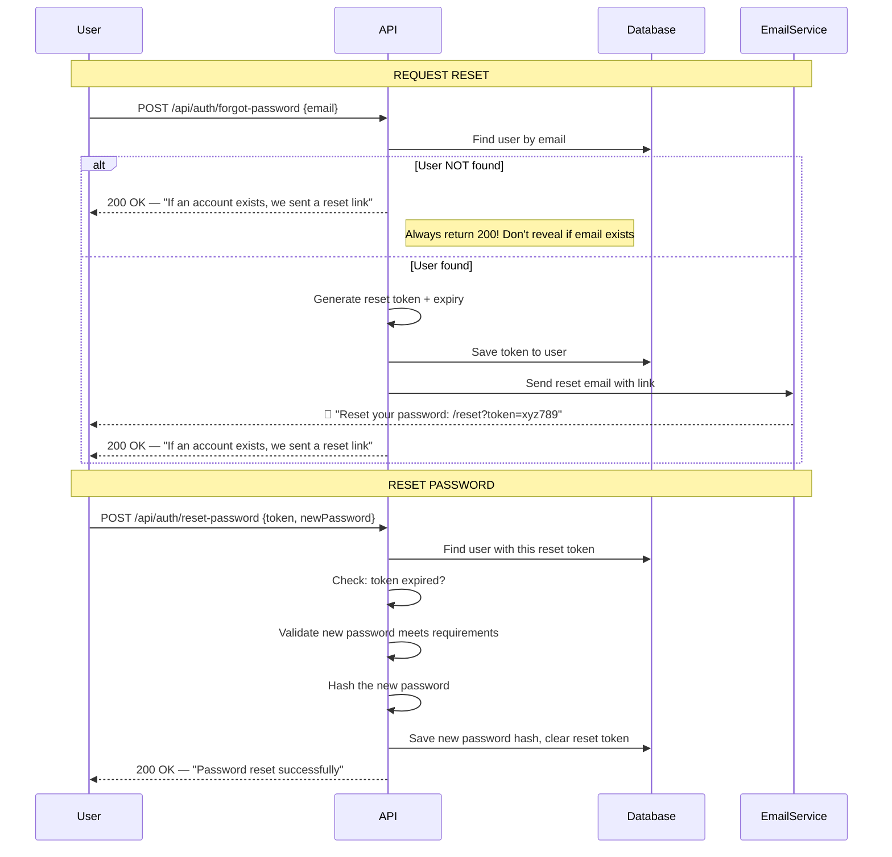

# 📧 Email Verification & Password Reset — Beginner Guide

This guide explains how to add **email verification** (confirm your email after registration) and **password reset** (forgot password flow) to your FirstApi project. No code — just concepts, architecture, and a step-by-step roadmap.

---

## Part 1: How It Works (The Core Concept)

Both features share the **same fundamental pattern**:

```
1. Generate a unique, time-limited TOKEN
2. Send that token to the user's EMAIL
3. User clicks a link containing the token
4. Server VALIDATES the token and performs the action
```

The only difference is **what happens after validation**:
- **Email verification** → mark the account as verified
- **Password reset** → allow the user to set a new password

---

## Part 2: What You Need

### A. An Email Sending Service (SMTP)

You need a way to actually **send emails**. Options:

| Service | Cost | Best For |
|---|---|---|
| **Gmail SMTP** | Free (500/day limit) | Learning & development |
| **Mailgun** | Free tier (100/day) | Small projects |
| **SendGrid** | Free tier (100/day) | Production apps |
| **Amazon SES** | Very cheap ($0.10/1000 emails) | High volume |
| **Mailtrap** | Free tier | Testing (emails don't actually deliver) |

For learning, **Gmail SMTP** or **Mailtrap** is easiest.

> **Gmail SMTP setup:** You'll need to create an "App Password" in your Google account settings (not your regular password). Go to Google Account → Security → 2-Step Verification → App Passwords.

### B. A NuGet Package for Emails

.NET has a built-in `System.Net.Mail.SmtpClient`, but it's considered outdated. The recommended package is:

```
dotnet add package MailKit
```

**MailKit** is the modern, well-maintained library for sending emails in .NET.

---

## Part 3: Email Verification

### Why Verify Emails?

- Confirms the user **actually owns** the email address
- Prevents fake/spam signups
- Ensures you can reach the user (for password resets, notifications, etc.)

### The Flow



### What Changes in Your Project

#### 1. Add fields to the `User` model

You need 3 new fields on your `User` entity:

| Field | Type | Purpose |
|---|---|---|
| `IsEmailVerified` | `bool` | Whether the email has been confirmed (default: `false`) |
| `EmailVerificationToken` | `string?` | The random token sent via email |
| `EmailVerificationTokenExpiry` | `DateTime?` | When the token expires |

#### 2. Update the Register flow

Currently, registration immediately returns a user. With email verification:

1. Create the user with `IsEmailVerified = false`
2. Generate a random token (e.g., using `Guid.NewGuid().ToString()` or a crypto-random string)
3. Set the token's expiry (e.g., 24 hours from now)
4. Save the token to the user record
5. Send an email with a verification link: `https://yourapi.com/api/auth/verify-email?token=abc123`
6. Return a message: "Registration successful. Please check your email to verify your account."

#### 3. Create a Verify Email endpoint

```
GET /api/auth/verify-email?token=abc123
```

This endpoint:
1. Finds the user with the matching `EmailVerificationToken`
2. Checks if the token has expired
3. Sets `IsEmailVerified = true`
4. Clears the token fields (so it can't be reused)
5. Returns success

#### 4. Update the Login flow

Add a check in `LoginUserAsync`: if `user.IsEmailVerified == false`, reject the login with a message like "Please verify your email before logging in."

#### 5. Create an Email Service

A new `EmailService` class that:
- Takes SMTP settings from `appsettings.json`
- Has a `SendEmailAsync(string to, string subject, string body)` method
- Uses MailKit to connect to the SMTP server and send the email

#### 6. Add SMTP settings to `appsettings.json`

```json
{
  "EmailSettings": {
    "SmtpServer": "smtp.gmail.com",
    "SmtpPort": 587,
    "SenderEmail": "yourapp@gmail.com",
    "SenderName": "FirstApi",
    "Password": "your-app-password"
  }
}
```

### Files to Create/Modify

| File | Action | Purpose |
|---|---|---|
| `Models/User.cs` | MODIFY | Add verification fields |
| `Services/EmailService.cs` | NEW | Email sending logic |
| `Services/AuthService.cs` | MODIFY | Generate token on register, verify token on verify-email, check verification on login |
| `Controllers/AuthController.cs` | MODIFY | Add verify-email endpoint |
| `appsettings.json` | MODIFY | Add SMTP configuration |
| `Program.cs` | MODIFY | Register `EmailService` in DI |
| New migration | CREATE | Update database schema |

---

## Part 4: Password Reset

### The Flow



### What Changes in Your Project

#### 1. Add fields to the `User` model

2 new fields:

| Field | Type | Purpose |
|---|---|---|
| `PasswordResetToken` | `string?` | The random token sent via email |
| `PasswordResetTokenExpiry` | `DateTime?` | When the token expires (shorter than email verification — e.g., 1 hour) |

#### 2. Create two new endpoints

**Endpoint 1: Forgot Password**

```
POST /api/auth/forgot-password
Body: { "email": "john@example.com" }
```

This endpoint:
1. Finds the user by email
2. Generates a random token + sets expiry (1 hour)
3. Saves the token to the user record
4. Sends a reset email with the token link
5. **Always returns 200 OK** regardless of whether the email was found

**Endpoint 2: Reset Password**

```
POST /api/auth/reset-password
Body: { "token": "xyz789", "newPassword": "NewPassword123!" }
```

This endpoint:
1. Finds the user with the matching `PasswordResetToken`
2. Checks if the token has expired
3. Validates the new password meets requirements
4. Hashes the new password
5. Updates the user's `PasswordHash`
6. Clears the reset token fields
7. Returns success

#### 3. Reuse your EmailService

You already built the `EmailService` for email verification — just call it with a different subject/body template for the reset email.

### Files to Create/Modify

| File | Action | Purpose |
|---|---|---|
| `Models/User.cs` | MODIFY | Add reset token fields |
| `Services/AuthService.cs` | MODIFY | Add forgot-password and reset-password logic |
| `Controllers/AuthController.cs` | MODIFY | Add 2 new endpoints |
| `DTOs/ForgotPasswordRequest.cs` | NEW | Request body for forgot-password |
| `DTOs/ResetPasswordRequest.cs` | NEW | Request body for reset-password (token + new password) |
| New migration | CREATE | Update database schema |

---

## Part 5: Generating Secure Tokens

Tokens need to be **unpredictable** so attackers can't guess them. There are two common approaches:

### Option A: GUID (Simple)

```
Guid.NewGuid().ToString()
→ "a1b2c3d4-e5f6-7890-abcd-ef1234567890"
```

**Pros:** Simple, built-in, unique
**Cons:** Not cryptographically random (though practically very hard to guess)

### Option B: Crypto-Random String (More Secure)

Use `RandomNumberGenerator` to generate a cryptographically secure random byte array, then convert to a string:

```
Convert.ToBase64String(RandomNumberGenerator.GetBytes(64))
→ "kX9F2mN7pQ3rT6wY..."
```

**Pros:** Cryptographically secure, industry standard
**Cons:** Slightly more code

For a learning project, **GUIDs are fine**. For production, use crypto-random strings.

---

## Part 6: Security Best Practices

| Rule | Why |
|---|---|
| **Always return the same response for forgot-password** | Whether the email exists or not, return "If an account exists, we sent a link." This prevents attackers from discovering which emails are registered. |
| **Set short token expiry for password reset** | 1 hour max. Email verification can be longer (24 hours). |
| **One-time use tokens** | Clear the token after it's used so it can't be replayed. |
| **Hash reset tokens before storing** | (Advanced) Just like passwords, you can hash the token before saving it. When the user submits it, hash their input and compare. This protects against database breaches. |
| **Rate limit the forgot-password endpoint** | Prevent attackers from spamming password reset emails. |
| **Validate the new password** | Reuse your existing `ValidPassword()` method in the reset flow. |
| **Don't include the actual password in the email** | Only send a link with a token. Never email plain-text passwords. |
| **Use HTTPS links** | The token is in the URL — HTTP would expose it to network sniffing. |

---

## Part 7: The Email Template

The email your users receive should contain a **clickable link** with the token. Example:

### Verification Email
```
Subject: Verify your email — FirstApi

Hi John,

Thanks for registering! Please verify your email by clicking the link below:

https://yourapi.com/api/auth/verify-email?token=a1b2c3d4-e5f6-7890

This link expires in 24 hours.

If you didn't create an account, please ignore this email.
```

### Password Reset Email
```
Subject: Reset your password — FirstApi

Hi John,

We received a request to reset your password. Click the link below:

https://yourapi.com/api/auth/reset-password?token=x1y2z3w4-a5b6-7890

This link expires in 1 hour.

If you didn't request this, please ignore this email.
```

> **Note:** In a real app with a frontend, these links would point to a frontend page (e.g., `https://yourapp.com/verify?token=abc123`) which then calls your API. Since your project is API-only, the links can point directly to your API endpoints.

---

## Part 8: All New User Model Fields (Summary)

After implementing both features, your `User` model will have these new fields:

| Field | Type | Default | Used By |
|---|---|---|---|
| `IsEmailVerified` | `bool` | `false` | Email verification |
| `EmailVerificationToken` | `string?` | `null` | Email verification |
| `EmailVerificationTokenExpiry` | `DateTime?` | `null` | Email verification |
| `PasswordResetToken` | `string?` | `null` | Password reset |
| `PasswordResetTokenExpiry` | `DateTime?` | `null` | Password reset |

---

## Part 9: All New Endpoints (Summary)

| Method | Endpoint | Purpose | Auth Required |
|---|---|---|---|
| `GET` | `/api/auth/verify-email?token=...` | Verify email address | ❌ No |
| `POST` | `/api/auth/forgot-password` | Request a password reset email | ❌ No |
| `POST` | `/api/auth/reset-password` | Reset password with token | ❌ No |

All three are **public** (no auth required) — the token in the URL/body serves as the authentication.

---

## Part 10: Implementation Order

Build these in order — email verification first, since password reset reuses the email service:

### Phase 1: Email Service
- [ ] Install `MailKit` NuGet package
- [ ] Add SMTP settings to `appsettings.json`
- [ ] Create `Services/EmailService.cs` with `SendEmailAsync()` method
- [ ] Register `EmailService` in `Program.cs`
- [ ] Test by sending a simple test email

### Phase 2: Email Verification
- [ ] Add verification fields to `User` model
- [ ] Create and apply migration
- [ ] Update `RegisterUserAsync` to generate token and send verification email
- [ ] Create `VerifyEmailAsync` method in `AuthService`
- [ ] Add `verify-email` endpoint to `AuthController`
- [ ] Update `LoginUserAsync` to check `IsEmailVerified`
- [ ] Test the full flow

### Phase 3: Password Reset
- [ ] Add reset token fields to `User` model
- [ ] Create and apply migration
- [ ] Create `DTOs/ForgotPasswordRequest.cs` and `DTOs/ResetPasswordRequest.cs`
- [ ] Add `ForgotPasswordAsync` and `ResetPasswordAsync` methods to `AuthService`
- [ ] Add `forgot-password` and `reset-password` endpoints to `AuthController`
- [ ] Test the full flow

---

## Part 11: Testing Without a Real Email Service

During development, you have options to test without actually sending emails:

| Approach | How |
|---|---|
| **Console logging** | Instead of sending an email, just print the token/link to the console. Fastest for development. |
| **Mailtrap.io** | A fake SMTP server that catches all emails in a web inbox. Emails never actually deliver. |
| **Papercut SMTP** | A local fake SMTP server you run on your machine. |
| **Return token in API response** | During development only, return the verification/reset token in the API response so you can test without email at all. **Remove this before production!** |

---

Let me know when you're ready to start implementing, and I'll be here to answer questions as you go! 🚀
